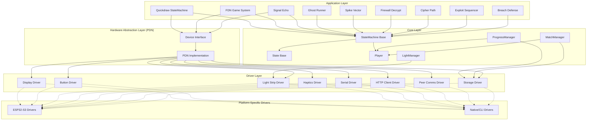
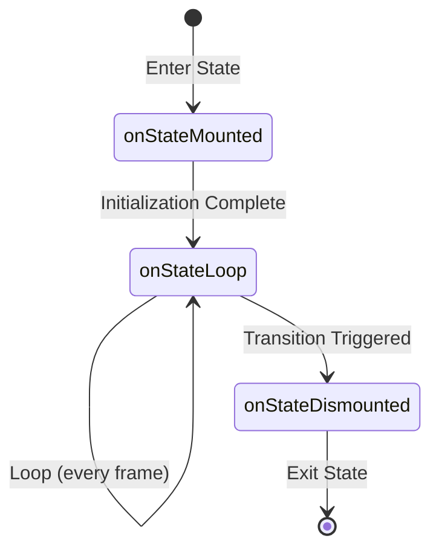
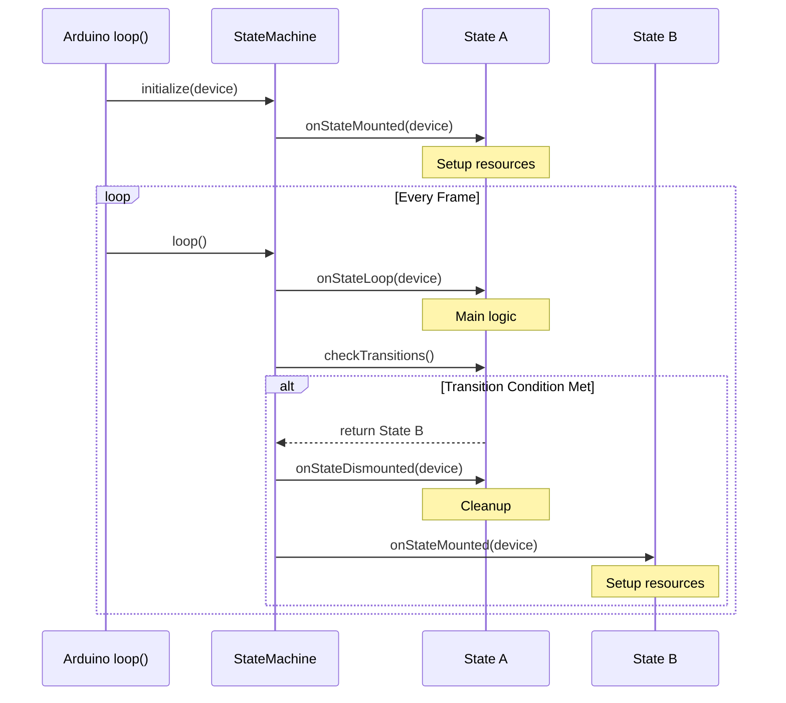
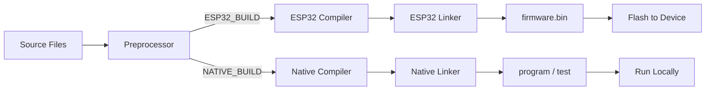
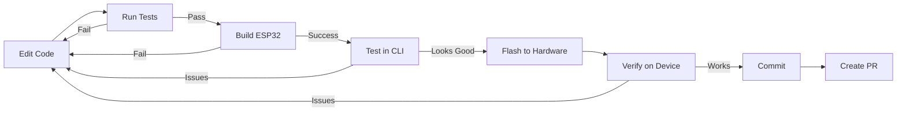

# PDN Architecture

System architecture documentation for the Portable Data Node embedded game platform.

## Table of Contents

- [Overview](#overview)
- [Component Diagram](#component-diagram)
- [Driver Abstraction Layer](#driver-abstraction-layer)
- [State Machine Pattern](#state-machine-pattern)
- [Build System](#build-system)
- [Platform Differences](#platform-differences)
- [Wireless Communication](#wireless-communication)
- [Persistence Layer](#persistence-layer)

---

## Overview

The PDN is an ESP32-S3 based embedded gaming device with:
- **Hardware:** OLED display, LED strips, haptics, 2 buttons, wireless (ESP-NOW + WiFi)
- **Main Game:** Neotropolis Quickdraw - real-time face-to-face dueling
- **FDN System:** 7 minigames for NPC challenges and Konami progression
- **Dual Platform:** Real hardware (ESP32-S3) + CLI simulator (native C++)

---

## Component Diagram



---

## Driver Abstraction Layer

The PDN uses a **driver pattern** to abstract hardware access, enabling both hardware and simulator builds from the same codebase.

### Architecture

```
Device (abstract interface)
    ↓
PDN (concrete implementation)
    ↓
Drivers (platform-specific)
    ├── ESP32-S3 drivers (real hardware)
    └── Native drivers (CLI simulator)
```

### Driver Interfaces

Each hardware component has an abstract driver interface:

| Driver | Interface | ESP32-S3 Implementation | Native Implementation |
|--------|-----------|------------------------|----------------------|
| Display | `Display` | `Esp32DisplayDriver` (U8g2) | `NativeDisplayDriver` (framebuffer) |
| Buttons | `Button` | `Esp32ButtonDriver` (OneButton) | `NativeButtonDriver` (event queue) |
| LEDs | `LightStrip` | `Esp32LightStripDriver` (FastLED) | `NativeLightStripDriver` (mock) |
| Haptics | `Haptics` | `Esp32HapticsDriver` (PWM) | `NativeHapticsDriver` (no-op) |
| Serial | `HWSerialWrapper` | `Esp32SerialDriver` (UART) | `NativeSerialDriver` (broker) |
| HTTP | `HttpClientInterface` | `Esp32HttpClientDriver` (WiFi) | `NativeHttpClientDriver` (mock server) |
| Peer Comms | `PeerCommsInterface` | `Esp32PeerCommsDriver` (ESP-NOW) | `NativePeerCommsDriver` (broker) |
| Storage | `StorageInterface` | `Esp32PrefsDriver` (NVS) | `NativePrefsDriver` (in-memory) |
| Clock | `PlatformClock` | `Esp32ClockDriver` (millis()) | `NativeClockDriver` (chrono) |
| Logger | `LoggerInterface` | `Esp32LoggerDriver` (Serial) | `NativeLoggerDriver` (stdout) |

### Benefits

1. **Hardware-less Development** - Full gameplay testing without physical devices
2. **Unit Testing** - Automated tests run in CI without hardware
3. **Portability** - Easy porting to new platforms (just implement drivers)
4. **Consistency** - Native drivers must match ESP32 behavior exactly for reliable testing

### Driver Selection

Drivers are selected at compile time via `DriverConfig`:

```cpp
// ESP32-S3 build
DriverConfig config;
config.displayDriver = new Esp32DisplayDriver();
config.buttonDriver = new Esp32ButtonDriver();
// ...
PDN* device = PDN::createPDN(config);

// Native/CLI build
DriverConfig config;
config.displayDriver = new NativeDisplayDriver();
config.buttonDriver = new NativeButtonDriver();
// ...
PDN* device = PDN::createPDN(config);
```

---

## State Machine Pattern

All game logic is implemented using hierarchical state machines.

### State Lifecycle

Every state has a 3-phase lifecycle:



### State Machine Control Flow



### Example State Implementation

```cpp
class ExampleState : public State {
public:
    ExampleState(StateMachine* parent) : State(STATE_ID) {
        // Register transitions
        addTransition({
            []() { return timeoutExpired; },  // Condition
            new NextState(parent)              // Target state
        });
    }

    void onStateMounted(Device* PDN) override {
        PDN->getDisplay()->drawText(0, 0, "Example State");
        timer.start(3000);  // 3-second timeout
    }

    void onStateLoop(Device* PDN) override {
        if (timer.hasExpired()) {
            timeoutExpired = true;
        }
        if (PDN->getPrimaryButton()->wasPressed()) {
            score++;
        }
    }

    void onStateDismounted(Device* PDN) override {
        PDN->getDisplay()->clear();
        timer.stop();
    }

private:
    Timer timer;
    int score = 0;
    bool timeoutExpired = false;
};
```

### Hierarchical State Machines

State machines can contain other state machines:

```
Quickdraw (StateMachine)
    ├── Idle (State)
    ├── DuelCountdown (State)
    └── FdnGame (StateMachine)
            ├── FdnDetected (State)
            └── SignalEcho (StateMachine)
                    ├── EchoIntro (State)
                    ├── EchoGameplay (State)
                    └── EchoWin (State)
```

When transitioning to a nested state machine, the parent calls `onStateMounted()`, which triggers `initialize()`, which mounts the first state in the nested machine's `stateMap`.

---

## Build System

The project uses **PlatformIO** with 5 distinct build environments.

### Environment Configuration

| Environment | Purpose | Platform | Command |
|------------|---------|----------|---------|
| `esp32-s3_debug` | Hardware dev build | ESP32-S3 | `pio run -e esp32-s3_debug` |
| `esp32-s3_release` | Hardware production | ESP32-S3 | `pio run -e esp32-s3_release` |
| `native` | Core unit tests | Native C++ | `pio test -e native` |
| `native_cli_test` | CLI integration tests | Native C++ | `pio test -e native_cli_test` |
| `native_cli` | CLI simulator **build** | Native C++ | `pio run -e native_cli` |

**Critical:** `native_cli` is a **build** environment, not a test environment. Use `native_cli_test` for running tests.

### Build Flags

**ESP32-S3 Debug:**
```ini
build_flags =
    -DESP32_BUILD
    -DCORE_DEBUG_LEVEL=3
    -fno-rtti  ; Disable RTTI (no dynamic_cast)
```

**ESP32-S3 Release:**
```ini
build_flags =
    -DESP32_BUILD
    -DCORE_DEBUG_LEVEL=0  ; No logging
    -Os  ; Optimize for size
    -fno-rtti
```

**Native:**
```ini
build_flags =
    -DNATIVE_BUILD
    -std=c++17
    -Wall -Wextra
```

### Directory Structure

```
pdn/
├── include/
│   ├── device/              # Hardware abstraction
│   │   ├── drivers/
│   │   │   ├── esp32-s3/    # Real hardware drivers
│   │   │   └── native/      # CLI simulator drivers
│   │   └── pdn.hpp
│   ├── game/                # Game logic
│   │   ├── quickdraw.hpp
│   │   ├── fdn-game.hpp
│   │   ├── minigame.hpp
│   │   ├── signal-echo/
│   │   ├── ghost-runner/
│   │   ├── spike-vector/
│   │   ├── firewall-decrypt/
│   │   ├── cipher-path/
│   │   ├── exploit-sequencer/
│   │   └── breach-defense/
│   ├── state/               # State machine core
│   │   ├── state-machine.hpp
│   │   └── state.hpp
│   ├── cli/                 # CLI simulator
│   │   ├── cli-device.hpp
│   │   ├── cli-commands.hpp
│   │   └── cli-renderer.hpp
│   └── utils/               # Utilities
│       ├── simple-timer.hpp
│       └── logger.hpp
├── src/                     # Implementation files
│   ├── main.cpp             # ESP32 entry point
│   ├── cli-main.cpp         # CLI entry point
│   ├── device/
│   ├── game/
│   └── state/
├── test/
│   ├── test_core/           # Core unit tests (GoogleTest)
│   └── test_cli/            # CLI integration tests
├── platformio.ini           # Build configuration
└── docs/                    # Documentation
```

### Compilation Flow



### Dependencies

**ESP32-S3 Libraries:**
- **U8g2** - OLED display rendering (I2C)
- **FastLED** - LED strip control (WS2812B)
- **OneButton** - Debounced button handling
- **ArduinoJson** - JSON serialization
- **WiFi / ESP-NOW** - Wireless communication
- **Preferences (NVS)** - Non-volatile storage

**Native/Testing Libraries:**
- **GoogleTest** - Unit testing framework
- **GoogleMock** - Mock object generation

---

## Platform Differences

### ESP32-S3 vs Native

| Feature | ESP32-S3 | Native/CLI |
|---------|----------|-----------|
| **Display** | SSD1306 OLED (128x64) | ASCII framebuffer (braille rendering) |
| **Buttons** | Physical GPIO pins | Keyboard events / CLI commands |
| **LEDs** | WS2812B strip (19 LEDs) | Mock (state tracked, no output) |
| **Haptics** | Motor via PWM | No-op (no output) |
| **Serial** | UART hardware | `SerialCableBroker` (in-memory) |
| **ESP-NOW** | 2.4GHz wireless | `NativePeerBroker` (in-memory) |
| **WiFi** | Real HTTP requests | Mock HTTP server (in-memory) |
| **Storage** | NVS flash (persistent) | In-memory map (ephemeral) |
| **Clock** | `millis()` hardware timer | `std::chrono` |
| **Logging** | Serial output | `stdout` |

### CLI Simulator Features

The native CLI simulator provides:

1. **Multi-Device Simulation** - Spawn up to 8 devices in one process
2. **Serial Cable Connections** - Simulate physical cable connections between devices
3. **Peer Communication** - Full ESP-NOW packet simulation via broker
4. **Mock HTTP Server** - Simulates backend API for user data and progress sync
5. **Display Mirror** - Braille rendering of OLED framebuffer to terminal
6. **State Inspection** - Real-time visibility into device states
7. **Scripting** - Demo scripts for automated testing and presentation

### Behavioral Parity

**Native drivers must match ESP32 behavior exactly.** For example:
- U8g2's `drawXBMP()` writes both ON and OFF pixels → Native equivalent must do the same
- Button debouncing timing must match between platforms
- Serial transmission delays must be simulated

This ensures tests pass on native **if and only if** they would pass on hardware.

---

## Wireless Communication

### ESP-NOW (Peer-to-Peer)

Fast, low-latency mesh network for device-to-device communication.

**Features:**
- Broadcast and unicast modes
- Up to 250 bytes per packet
- No WiFi infrastructure required
- ~10ms latency

**Packet Types:**
```cpp
enum class PktType : uint8_t {
    HANDSHAKE = 0,
    MATCH_DATA = 1,
    DRAW_SIGNAL = 2,
    RESULT = 3,
    FDN_CHALLENGE = 4,
    FDN_RESPONSE = 5,
};
```

**Use Cases:**
- Quickdraw duel handshake and results
- FDN challenge broadcasts from NPCs
- Direct player-to-player communication

### WiFi (HTTP Client)

Connects to backend server for:
- User data fetch (`GET /api/user/:id`)
- Match upload (`POST /api/matches`)
- Progress sync (`PUT /api/progress`)
- Progress download (`GET /api/progress`)

**Connection Modes:**
- **Online:** Full server connectivity
- **Offline:** Local-only mode (prompted if server unreachable)

---

## Persistence Layer

### NVS (Non-Volatile Storage)

ESP32-S3 uses **NVS (Non-Volatile Storage)** for persistence across power cycles.

**Stored Data:**

| Key | Type | Purpose |
|-----|------|---------|
| `konami` | uint8_t | Bitmask of unlocked Konami buttons (7 bits) |
| `konami_boon` | uint8_t | Konami puzzle complete flag (0/1) |
| `color_profile` | uint8_t | Equipped color profile (gameType + 1, 0 = none) |
| `color_elig` | uint8_t | Bitmask of eligible color profiles (7 bits) |
| `easy_att_N` | uint8_t | Easy mode attempts for game N (0-6) |
| `hard_att_N` | uint8_t | Hard mode attempts for game N (0-6) |
| `synced` | uint8_t | Whether progress uploaded to server (0/1) |
| `match_count` | uint8_t | Number of stored matches |
| `match_N` | blob | Serialized match data |

### Conflict Resolution

When syncing progress between device and server, conflicts are resolved using:

1. **Bitmask fields** (konami, colorEligibility): **Union merge** (bitwise OR)
   - Local has bits 0,1,2 → Server has bits 1,2,3 → Result: 0,1,2,3
2. **Attempt counts**: **Max-wins** (keep higher value per game/difficulty)
   - Local easy attempts: [2,3,1] → Server: [1,4,2] → Result: [2,4,2]

This ensures progress is never lost and accommodates multiple devices per user.

---

## Testing Strategy

### Test Pyramid

```
                   ▲
                  / \
                 /   \
                /     \
               /  E2E  \           End-to-End (CLI integration tests)
              /---------\
             /           \
            /   Integration \      FDN protocol, progression tests
           /---------------\
          /                 \
         /   Unit Tests      \    Core state machine, Player, timers
        /---------------------\
```

### Test Environments

1. **Core Unit Tests** (`test_core/`, env: `native`)
   - State machine logic
   - Player stats and progression
   - Timers, utilities
   - Run: `pio test -e native`

2. **CLI Integration Tests** (`test_cli/`, env: `native_cli_test`)
   - Full minigame gameplay
   - FDN protocol
   - Multi-device interactions
   - Konami progression E2E
   - Run: `pio test -e native_cli_test`

3. **Hardware Testing** (manual, env: `esp32-s3_debug`)
   - Flash to device
   - Physical button/display interaction
   - Real wireless communication

### Test Organization

CLI tests use a **split pattern**:
- **Test functions** in `.hpp` headers (e.g., `ghost-runner-tests.hpp`)
- **TEST_F registrations** in per-domain `.cpp` files (e.g., `ghost-runner-reg-tests.cpp`)

This keeps test logic separate from GoogleTest boilerplate.

---

## Security Practices

### WiFi Credentials

Never commit credentials to git:

```bash
# Create from template
cp wifi_credentials.ini.example wifi_credentials.ini

# Edit with real credentials
nano wifi_credentials.ini
```

PlatformIO injects credentials at build time via `extra_scripts = pre:inject_wifi_creds.py`.

### Gitignored Files

```
wifi_credentials.ini
.env
*.log
.pio/
.vscode/
.idea/
.cursor/
compile_commands.json
```

---

## Development Workflow

### Typical Development Loop



### Commands

```bash
# Development cycle
pio test -e native              # Core tests (fast)
pio test -e native_cli_test     # CLI tests (slower)
pio run -e native_cli           # Build simulator
.pio/build/native_cli/program 2 # Run with 2 devices
pio run -e esp32-s3_debug       # Build hardware
pio run -e esp32-s3_debug --target upload  # Flash
pio device monitor              # View serial output
```

### Helper Scripts

```bash
./dev.sh test           # Run all tests
./dev.sh build          # Build release firmware
./dev.sh sim 3          # Run simulator with 3 devices
./dev.sh full-check     # Complete verification
```

---

## Future Architecture Improvements

### Potential Enhancements

1. **OTA Updates** - Over-the-air firmware updates via WiFi
2. **Persistent Match Storage** - Circular buffer in NVS for offline match queue
3. **Display Driver Optimization** - Partial updates to reduce I2C traffic
4. **Power Management** - Deep sleep modes for battery operation
5. **Audio Output** - Add piezo speaker driver for sound effects
6. **Accelerometer** - Add IMU driver for gesture controls

---

## Further Reading

- [API.md](API.md) - Complete API reference
- [GAME-MECHANICS.md](GAME-MECHANICS.md) - Gameplay rules and difficulty tuning
- [STATE-MACHINES.md](STATE-MACHINES.md) - Detailed state flow diagrams
- [HACKATHON-REPORT.md](HACKATHON-REPORT.md) - Development timeline
- [../CLAUDE.md](../CLAUDE.md) - Developer guide for AI agents

---

*Last Updated: 2026-02-14*
