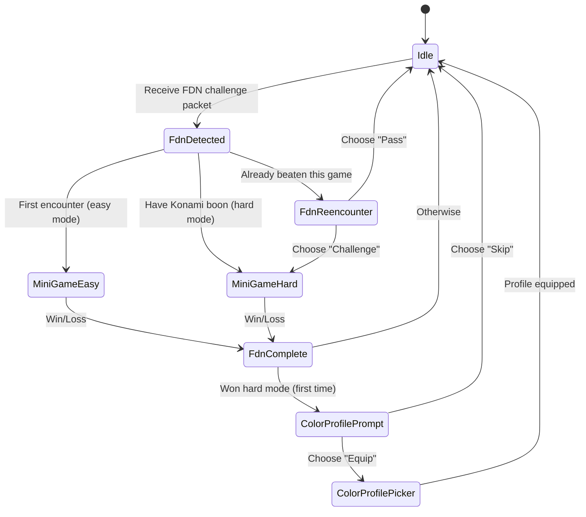

# PDN Game Mechanics

Complete gameplay guide for all minigames in the Portable Data Node FDN system.

## Table of Contents

- [Konami Progression System](#konami-progression-system)
- [Color Profile System](#color-profile-system)
- [FDN Encounter Flow](#fdn-encounter-flow)
- [Minigames](#minigames)
  - [Signal Echo](#signal-echo)
  - [Ghost Runner](#ghost-runner)
  - [Spike Vector](#spike-vector)
  - [Firewall Decrypt](#firewall-decrypt)
  - [Cipher Path](#cipher-path)
  - [Exploit Sequencer](#exploit-sequencer)
  - [Breach Defense](#breach-defense)
- [Difficulty Tuning](#difficulty-tuning)

---

## Konami Progression System

The Konami system is a **meta-game** that tracks player progression across all 7 minigames.

### Konami Buttons

Each minigame unlocks a specific button from the classic Konami controller:

| Button | Index | Minigame | GameType |
|--------|-------|----------|----------|
| **UP** | 0 | Signal Echo | `SIGNAL_ECHO` |
| **DOWN** | 1 | Spike Vector | `SPIKE_VECTOR` |
| **LEFT** | 2 | Firewall Decrypt | `FIREWALL_DECRYPT` |
| **RIGHT** | 3 | Cipher Path | `CIPHER_PATH` |
| **B** | 4 | Exploit Sequencer | `EXPLOIT_SEQUENCER` |
| **A** | 5 | Breach Defense | `BREACH_DEFENSE` |
| **START** | 6 | Ghost Runner | `GHOST_RUNNER` |

### Progression Tracking

Progress is stored as a **7-bit bitmask**:

```
0b0FEDCBA  (bits 0-6, MSB unused)
  │││││││
  ││││││└─ UP (Signal Echo)
  │││││└── DOWN (Spike Vector)
  ││││└─── LEFT (Firewall Decrypt)
  │││└──── RIGHT (Cipher Path)
  ││└───── B (Exploit Sequencer)
  │└────── A (Breach Defense)
  └─────── START (Ghost Runner)
```

**Example:**
- `0x01` (0b0000001) = Only Signal Echo unlocked
- `0x7F` (0b1111111) = All 7 buttons unlocked
- `0x55` (0b1010101) = UP, LEFT, B, START unlocked

### Konami Boon

When all 7 buttons are collected (`progress == 0x7F`), the player earns the **Konami Boon**:
- Auto-set when `player->hasAllKonamiButtons()` returns true
- Grants special reward (implementation TBD)
- Persists across sessions (NVS: `konami_boon`)

### CLI Commands

```bash
# View progress
progress 0

# Set progress directly (for testing)
konami 0 127  # Unlock all buttons (0x7F)
konami 0 1    # Unlock only Signal Echo (0x01)
```

---

## Color Profile System

Players unlock **custom LED color profiles** by beating minigames on **hard mode**.

### Earning Profiles

- Beat any minigame on **EASY** = unlock Konami button
- Beat any minigame on **HARD** = unlock Konami button **+ color profile eligibility**

### Equipped Profile

- **Default:** Hunter/Bounty-specific default colors
- **Game-Specific:** Unlock by beating that game on hard mode
- Only one profile can be equipped at a time
- Profile persists across sessions (NVS: `color_profile`)

### Profile Application

When a color profile is equipped:
- **Idle state LEDs** use the game's color scheme
- **Duel animations** may incorporate profile colors (implementation-dependent)

### CLI Commands

```bash
# View color profiles
colors 0

# Output:
# [*] HUNTER DEFAULT (default)
# [ ] Ghost Runner (equipped)
# [X] Spike Vector (locked - beat hard mode to unlock)
```

---

## FDN Encounter Flow

FDN (Field Data Node) encounters are the mechanism for NPC minigame challenges.

### Encounter Sequence



### FDN Challenge Packet

NPCs broadcast FDN challenges via ESP-NOW:

```cpp
PktType::FDN_CHALLENGE
Payload: {
    gameType: uint8_t,       // 0-6 (GameType enum)
    reward: uint8_t,         // Konami button index
    difficulty: uint8_t,     // 0 = easy, 1 = hard
}
```

### Difficulty Routing

**First Encounter (Easy Mode):**
- Player sees game for first time
- FdnDetected launches easy mode
- Win = unlock Konami button
- Loss = no reward (can retry)

**Konami Boon Unlocked (Hard Mode):**
- Player has collected all 7 buttons
- FdnDetected launches hard mode automatically
- Win = unlock color profile eligibility
- Loss = no reward (can retry)

**Re-encounter:**
- Player has already beaten this game (button unlocked)
- FdnReencounter prompts: "Challenge" (hard mode) or "Pass"
- "Challenge" = recreational mode (no rewards, for fun)
- "Pass" = return to Idle

### Recreational Mode

When replaying already-beaten content:
- `player->setRecreationalMode(true)`
- FdnComplete skips reward logic
- No Konami button unlock (already have it)
- No color profile unlock (only first hard win)

---

## Minigames

All 7 minigames follow a common structure:
1. **Intro** (2s) - Title screen
2. **Show** (1.5s) - Round/wave info
3. **Gameplay** - Player interaction
4. **Evaluate** - Check win/loss
5. **Win/Lose** (3s) - Outcome display

---

## Signal Echo

**Genre:** Memory/Pattern Replication (Simon Says)
**App ID:** 2 | **GameType:** `SIGNAL_ECHO` | **Konami:** UP (0)

### Rules

1. Device plays a sequence of UP/DOWN signals
2. Player reproduces sequence using buttons
3. Correct sequence advances to next round
4. Wrong input counts as mistake
5. Win = complete all rounds without exceeding mistake limit

### Controls

- **PRIMARY** = UP signal (▲)
- **SECONDARY** = DOWN signal (▼)

### Difficulty Parameters

| Parameter | Easy | Hard |
|-----------|------|------|
| `sequenceLength` | 4 | 5 |
| `numSequences` | 3 | 5 |
| `displaySpeedMs` | 600 | 400 |
| `allowedMistakes` | 2 | 1 |
| `cumulative` | false | false |
| `timeLimitMs` | 0 (none) | 0 (none) |

### Scoring

- +1 point per correct input
- Mistakes decrement strike counter
- Final score = total correct inputs

### Win/Loss Display

- **Win:** "ACCESS GRANTED"
- **Loss:** "SIGNAL LOST"

### Strategy Tips

- Watch the entire sequence before responding
- Use rhythm to memorize patterns
- Hard mode has 5 rounds with only 1 mistake allowed

---

## Ghost Runner

**Genre:** Reaction/Timing
**App ID:** 4 | **GameType:** `GHOST_RUNNER` | **Konami:** START (6)

### Rules

1. Ghost scrolls across screen (position 0 → `screenWidth`)
2. Press PRIMARY when ghost enters target zone
3. Hit = advance round; Miss = strike
4. Miss conditions: outside zone OR timeout
5. Win = complete all rounds without exceeding miss limit

### Controls

- **PRIMARY** = Attempt catch

### Difficulty Parameters

| Parameter | Easy | Hard |
|-----------|------|------|
| `ghostSpeedMs` | 50 | 30 |
| `targetZoneStart` | 35 | 42 |
| `targetZoneEnd` | 65 | 58 |
| **Zone Width** | **30 units** | **16 units** |
| `rounds` | 4 | 6 |
| `missesAllowed` | 3 | 1 |
| `screenWidth` | 100 | 100 |

### Scoring

- +100 points per successful catch
- Misses decrement strike counter

### Win/Loss Display

- **Win:** "RUN COMPLETE"
- **Loss:** "GHOST CAUGHT"

### Strategy Tips

- Watch the ghost's speed
- Wait for the zone indicator to light up
- Hard mode has narrower zone (16 vs 30 units) and faster speed

---

## Spike Vector

**Genre:** Reaction/Dodging
**App ID:** 5 | **GameType:** `SPIKE_VECTOR` | **Konami:** DOWN (1)

### Rules

1. Wall with a gap advances toward player
2. Player moves cursor UP/DOWN to align with gap
3. Wall arrives = collision check
4. Cursor at gap = dodge; elsewhere = hit
5. Win = survive all waves without exceeding hit limit

### Controls

- **PRIMARY** = Move cursor UP (decrease lane)
- **SECONDARY** = Move cursor DOWN (increase lane)

### Difficulty Parameters

| Parameter | Easy | Hard |
|-----------|------|------|
| `approachSpeedMs` | 40 | 20 |
| `numPositions` | 5 lanes | 7 lanes |
| `waves` | 5 | 8 |
| `hitsAllowed` | 3 | 1 |
| `trackLength` | 100 | 100 |

### Scoring

- +100 points per successful dodge
- Hits decrement strike counter

### Win/Loss Display

- **Win:** "VECTOR CLEAR"
- **Loss:** "SPIKE IMPACT"

### Strategy Tips

- Track which lane the gap is in
- Move early - walls approach fast
- Hard mode has 7 lanes (more to track) and faster approach

---

## Firewall Decrypt

**Genre:** Pattern Recognition/Puzzle
**App ID:** 3 | **GameType:** `FIREWALL_DECRYPT` | **Konami:** LEFT (2)

### Rules

1. Target MAC address displayed at top
2. Scrollable list of candidates below (includes target + decoys)
3. Player scrolls with PRIMARY, confirms with SECONDARY
4. Correct match = advance round; wrong = instant loss
5. Win = identify target in all rounds

### Controls

- **PRIMARY** = Scroll down through candidates
- **SECONDARY** = Confirm selection

### Difficulty Parameters

| Parameter | Easy | Hard |
|-----------|------|------|
| `numCandidates` | 5 | 10 |
| `numRounds` | 3 | 4 |
| `similarity` | 0.2 (obvious) | 0.5+ (subtle) |
| `timeLimitMs` | 0 (none) | 15000 (15s) |

### Scoring

- Points based on speed and decoy similarity
- Exact formula: implementation-dependent

### Win/Loss Display

- **Win:** "DECRYPTED!"
- **Loss:** "FIREWALL INTACT"

### Strategy Tips

- Compare byte-by-byte (MAC format: `XX:XX:XX:XX:XX:XX`)
- Hard mode has subtle differences (1-2 bytes changed)
- 15-second time limit on hard mode

---

## Cipher Path

**Genre:** Puzzle/Pathfinding
**App ID:** 6 | **GameType:** `CIPHER_PATH` | **Konami:** RIGHT (3)

### Rules

1. Linear path from start (0) to exit (`gridSize-1`)
2. Each position has cipher: correct direction is UP or DOWN
3. Player guesses direction; correct = advance, wrong = waste move
4. Win = reach exit within move budget
5. Loss = moves exhausted before exit

### Controls

- **PRIMARY** = Guess UP at current position
- **SECONDARY** = Guess DOWN at current position

### Difficulty Parameters

| Parameter | Easy | Hard |
|-----------|------|------|
| `gridSize` | 6 | 10 |
| `moveBudget` | 12 (2x) | 14 (1.4x) |
| `rounds` | 2 | 4 |

### Scoring

- Based on efficiency (moves remaining)
- Exact formula: implementation-dependent

### Win/Loss Display

- **Win:** "PATH DECODED"
- **Loss:** "PATH LOST"

### Strategy Tips

- Each wrong guess wastes a move
- Easy mode: generous budget (2x path length)
- Hard mode: tight budget (1.4x path length)

---

## Exploit Sequencer

**Genre:** QTE (Quick Time Event)
**App ID:** 7 | **GameType:** `EXPLOIT_SEQUENCER` | **Konami:** B (4)

### Rules

1. Symbol scrolls across buffer (position 0 → `scrollLength`)
2. Player presses PRIMARY when symbol reaches marker
3. Hit = within `timingWindow` of marker; miss = outside
4. Multiple exploits per sequence, multiple sequences per game
5. Win = execute all exploits; Loss = fails exceed limit

### Controls

- **PRIMARY** = Attempt exploit

### Difficulty Parameters

| Parameter | Easy | Hard |
|-----------|------|------|
| `scrollSpeedMs` | 40 | 25 |
| `timingWindow` | 15 (wide) | 6 (narrow) |
| `markerPosition` | 50 (center) | 50 (center) |
| `scrollLength` | 100 | 100 |
| `exploitsPerSeq` | 2 | 4 |
| `sequences` | 2 | 4 |
| `failsAllowed` | 3 | 1 |

### Scoring

- +100 points per successful hit
- Fails decrement strike counter

### Win/Loss Display

- **Win:** "EXPLOIT DONE"
- **Loss:** "EXPLOIT FAILED"

### Strategy Tips

- Watch the marker position (center of screen)
- Press when symbol overlaps marker
- Hard mode: faster scroll + narrower window (6 units)

---

## Breach Defense

**Genre:** Reaction/Defense
**App ID:** 8 | **GameType:** `BREACH_DEFENSE` | **Konami:** A (5)

### Rules

1. Threat approaches in random lane
2. Player positions shield with UP/DOWN buttons
3. Threat arrives = collision check
4. Shield at threat lane = block; elsewhere = breach
5. Win = block all threats; Loss = breaches exceed limit

### Controls

- **PRIMARY** = Move shield UP (decrease lane)
- **SECONDARY** = Move shield DOWN (increase lane)

### Difficulty Parameters

| Parameter | Easy | Hard |
|-----------|------|------|
| `numLanes` | 3 | 5 |
| `threatSpeedMs` | 40 | 20 |
| `threatDistance` | 100 | 100 |
| `totalThreats` | 6 | 12 |
| `missesAllowed` | 3 | 1 |

### Scoring

- +100 points per successful block
- Breaches decrement strike counter

### Win/Loss Display

- **Win:** "BREACH BLOCKED"
- **Loss:** "BREACH OPEN"

### Strategy Tips

- Track which lane the threat is approaching
- Move shield early - threats approach fast
- Hard mode: 5 lanes (more positions) + faster threats

---

## Difficulty Tuning

### Easy vs Hard Mode Comparison

| Aspect | Easy Mode | Hard Mode |
|--------|-----------|-----------|
| **Speed** | Slower (40-50ms) | Faster (20-30ms) |
| **Precision** | Wider windows/zones | Narrower windows/zones |
| **Rounds** | Fewer (2-5) | More (4-8) |
| **Mistakes** | Generous (2-3) | Strict (1-2) |
| **Time Limits** | Often none | Sometimes enforced |
| **Complexity** | Fewer options/lanes | More options/lanes |

### Tuning Principles

1. **Speed:** Hard mode is ~50% faster (lower ms values)
2. **Margin:** Hard mode has ~50% narrower hit windows
3. **Endurance:** Hard mode has ~50-100% more rounds/waves
4. **Forgiveness:** Hard mode allows 1-2 mistakes vs 2-3 in easy

### Balancing Goals

- **Easy:** Accessible to all players, focuses on learning mechanics
- **Hard:** Requires mastery, tests reaction time and precision
- **Progression:** Easy unlocks content, hard unlocks cosmetics

### Attempt Tracking

Per-game per-difficulty attempt counters (persisted to NVS):

```cpp
player->incrementEasyAttempts(GameType::GHOST_RUNNER);
player->incrementHardAttempts(GameType::GHOST_RUNNER);

uint8_t easyAttempts = player->getEasyAttempts(GameType::GHOST_RUNNER);
uint8_t hardAttempts = player->getHardAttempts(GameType::GHOST_RUNNER);
```

**Use Cases:**
- Track player progression
- Adjust difficulty dynamically (future)
- Server analytics

---

## Minigame Selection Guide

| Game | Best For | Skill Focus |
|------|----------|-------------|
| **Signal Echo** | Memory | Pattern recognition |
| **Ghost Runner** | Timing | Reaction speed |
| **Spike Vector** | Coordination | Multi-tasking |
| **Firewall Decrypt** | Observation | Detail focus |
| **Cipher Path** | Logic | Resource management |
| **Exploit Sequencer** | Precision | Timing accuracy |
| **Breach Defense** | Awareness | Spatial tracking |

---

## Further Reading

- [API.md](API.md) - Player progression API
- [STATE-MACHINES.md](STATE-MACHINES.md) - Minigame state flows
- [ARCHITECTURE.md](ARCHITECTURE.md) - System design
- [HACKATHON-REPORT.md](HACKATHON-REPORT.md) - Development history

---

*Last Updated: 2026-02-14*
