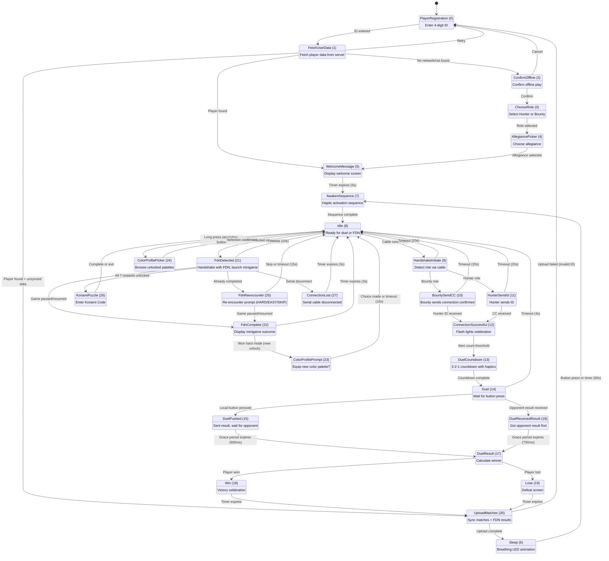
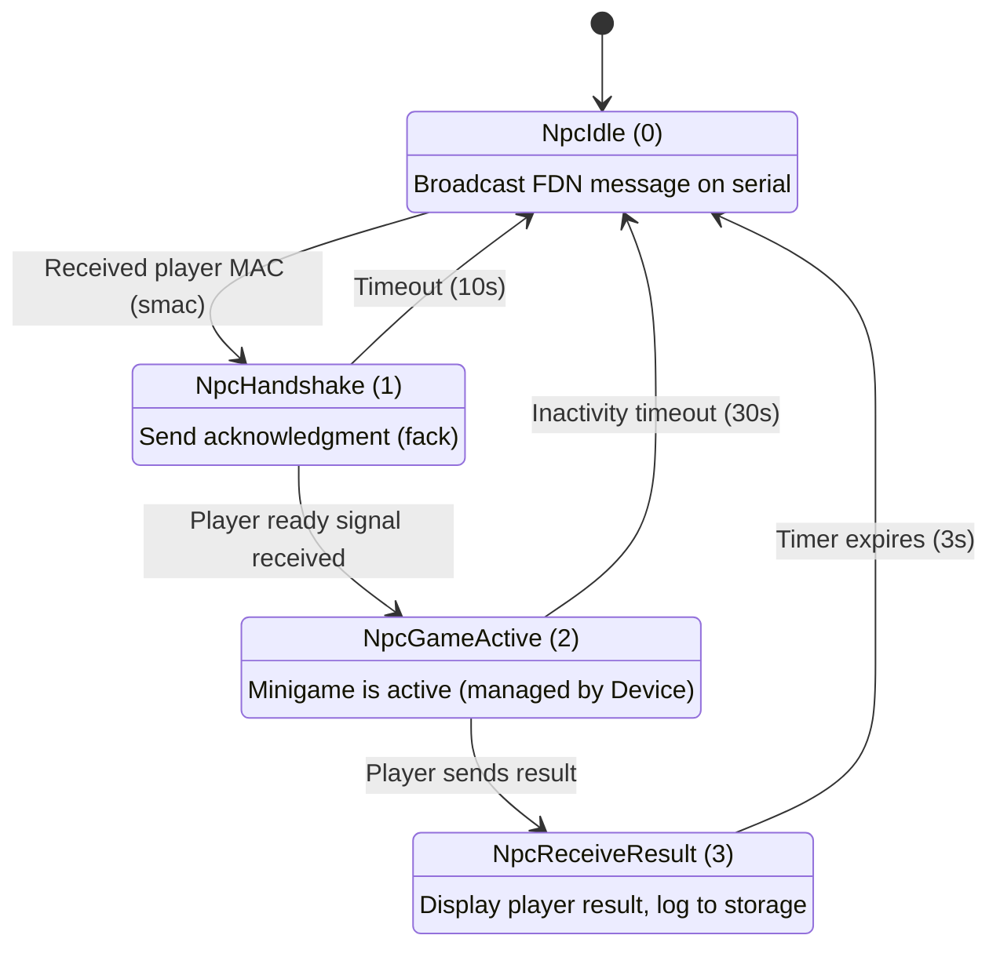
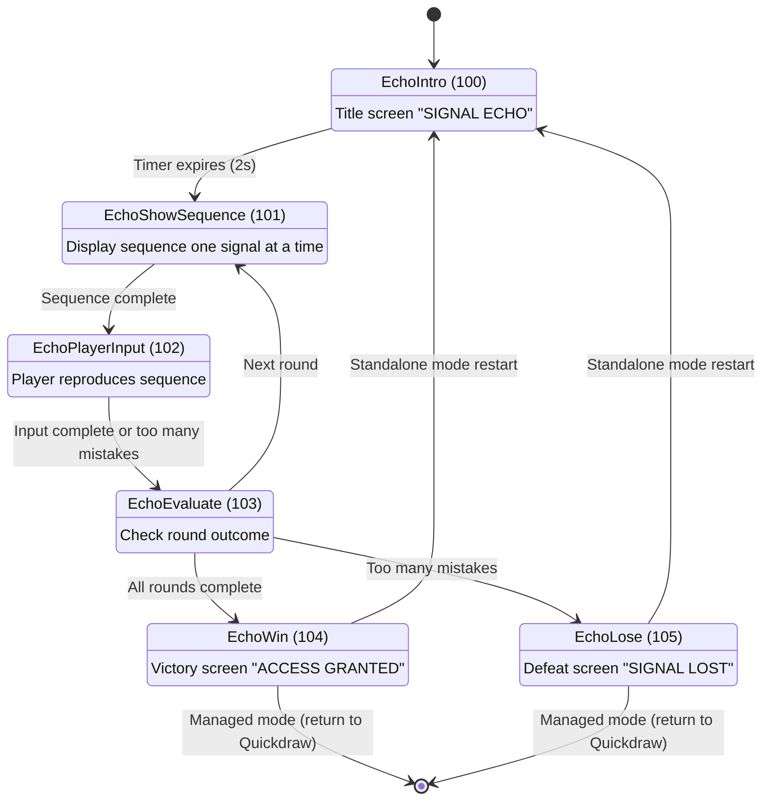
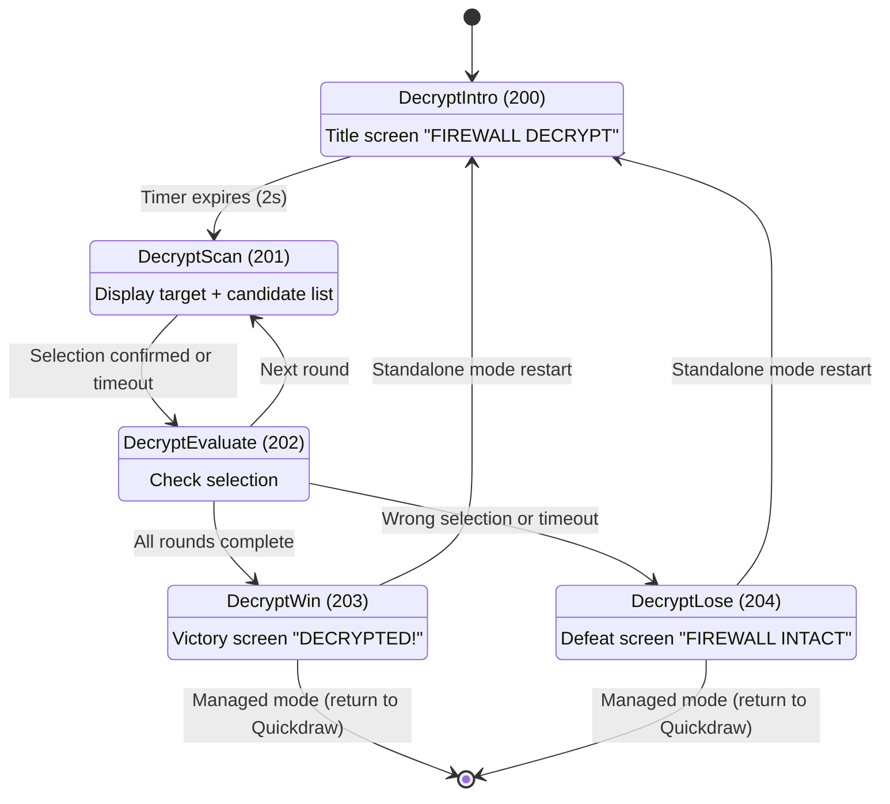
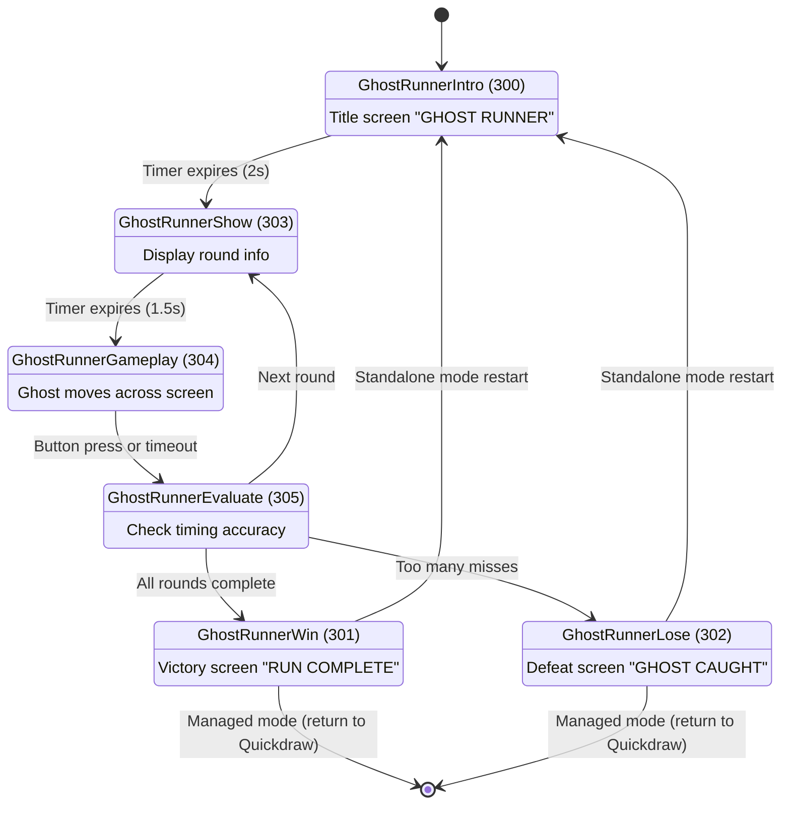
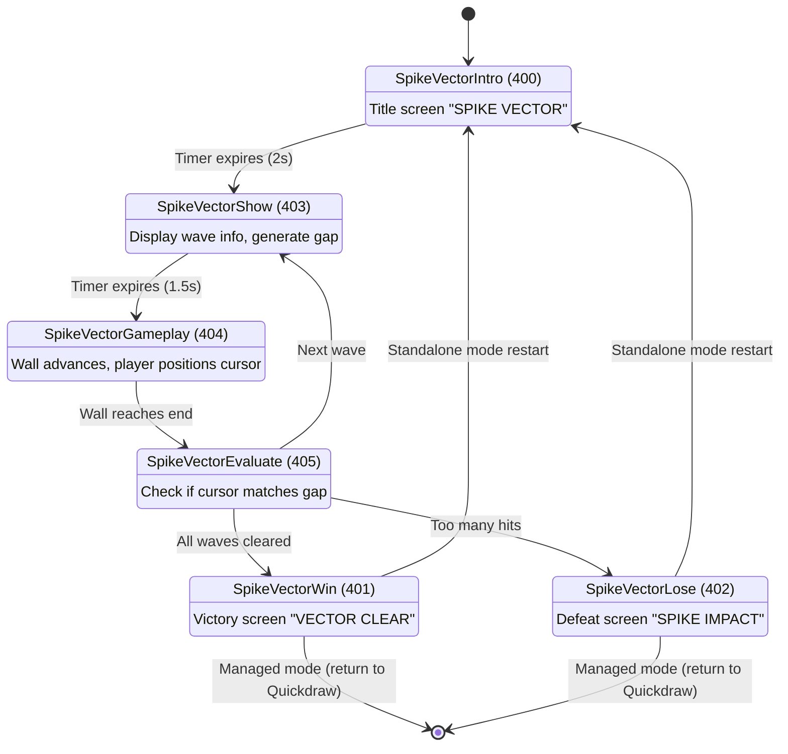
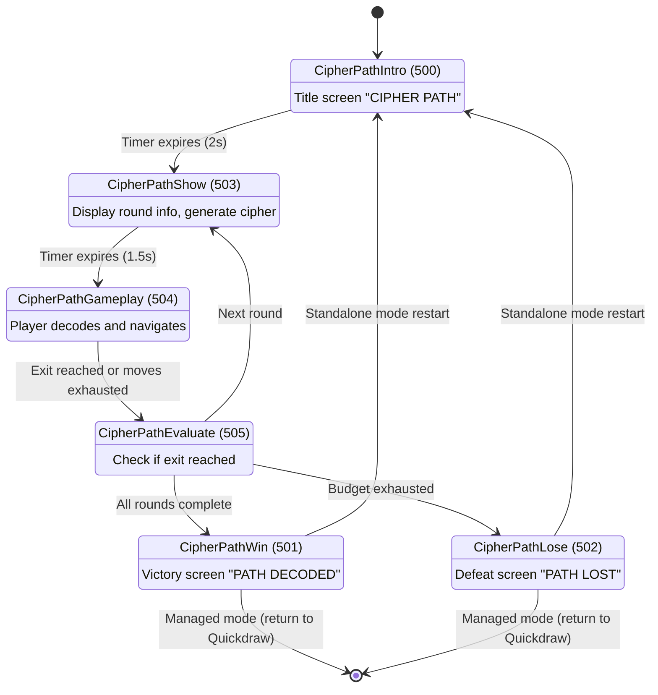
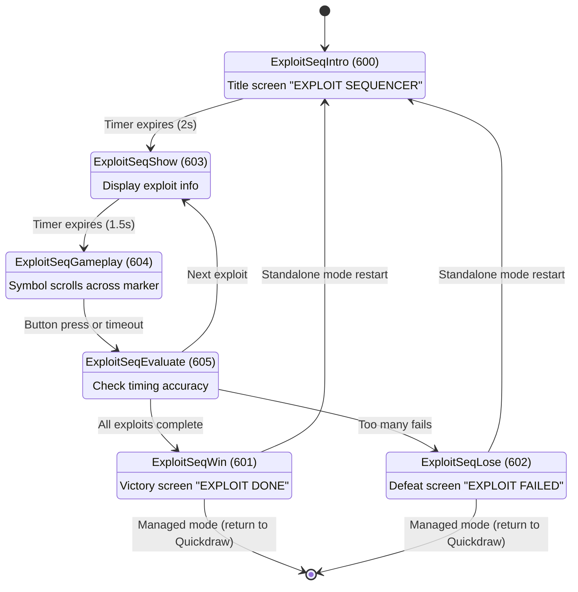
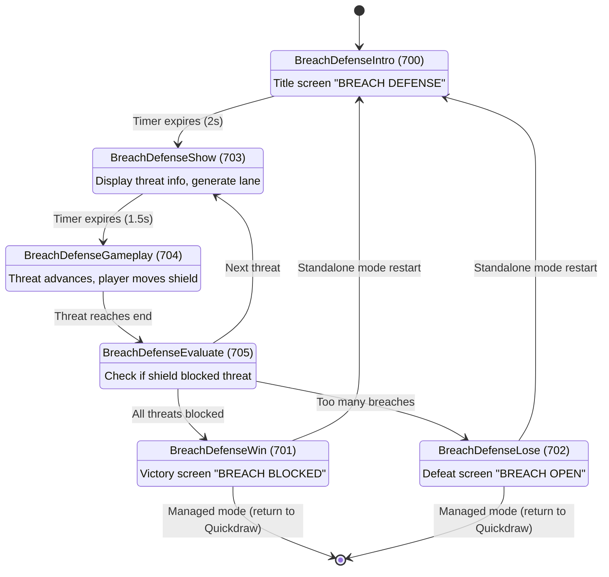

# PDN State Machines

This document provides comprehensive state machine diagrams for all gameplay systems in the PDN (Portable Data Node). Each state machine uses the standard State Pattern with lifecycle methods (`onStateMounted`, `onStateLoop`, `onStateDismounted`).

## Table of Contents

1. [Quickdraw Main State Machine](#quickdraw-main-state-machine)
2. [FDN Game Flow](#fdn-game-flow)
3. [Minigames](#minigames)
   - [Signal Echo](#signal-echo)
   - [Firewall Decrypt](#firewall-decrypt)
   - [Ghost Runner](#ghost-runner)
   - [Spike Vector](#spike-vector)
   - [Cipher Path](#cipher-path)
   - [Exploit Sequencer](#exploit-sequencer)
   - [Breach Defense](#breach-defense)

---

## Quickdraw Main State Machine

The Quickdraw game is the primary game mode featuring 28 states covering registration, role selection, idle state, dueling, and FDN encounters.



### State Descriptions

- **PlayerRegistration (0)**: Player enters 4-digit ID using buttons
- **FetchUserData (1)**: Attempts to fetch player data from server via WiFi
- **ConfirmOffline (2)**: Prompts for confirmation to play offline when network unavailable
- **ChooseRole (3)**: Select Hunter or Bounty role (offline only)
- **AllegiancePicker (4)**: Choose faction allegiance (offline only)
- **WelcomeMessage (5)**: Brief welcome screen with player info
- **Sleep (6)**: Low-power idle state with breathing LED
- **AwakenSequence (7)**: Haptic motor activation sequence
- **Idle (8)**: Main waiting state, displays stats and waits for connection
- **HandshakeInitiate (9)**: Cable connection detected, determine roles
- **BountySendCC (10)**: Bounty sends connection confirmation
- **HunterSendId (11)**: Hunter sends player ID
- **ConnectionSuccessful (12)**: Handshake complete, flash celebration
- **DuelCountdown (13)**: 3-2-1-BATTLE countdown with haptics
- **Duel (14)**: Active duel state waiting for button press
- **DuelPushed (15)**: Player pressed button, waiting for opponent
- **DuelReceivedResult (16)**: Received opponent's result first
- **DuelResult (17)**: Calculate and display outcome
- **Win (18)**: Victory celebration with LED/haptic effects
- **Lose (19)**: Defeat screen
- **UploadMatches (20)**: Sync match data and FDN results to server
- **FdnDetected (21)**: FDN encounter detected, perform handshake and launch minigame
- **FdnComplete (22)**: Display minigame outcome and update progress
- **ColorProfilePrompt (23)**: Prompt to equip newly unlocked color palette
- **ColorProfilePicker (24)**: Browse and select color palettes (manual entry)
- **FdnReencounter (25)**: Re-encounter prompt for already-beaten FDN
- **KonamiPuzzle (26)**: Meta-game puzzle unlocked when all 7 rewards collected
- **ConnectionLost (27)**: Error state when serial connection drops during FDN encounter

---

## FDN Game Flow

The FDN (Fixed Data Node) is an NPC device that hosts minigames. It has 4 states managing the interaction lifecycle.



### State Descriptions

- **NpcIdle (0)**: Broadcasts FDN announcement (game type + reward) on serial every 500ms
- **NpcHandshake (1)**: Receives player MAC address, sends acknowledgment (fack), waits for ready signal
- **NpcGameActive (2)**: Minigame is active on player device (NPC mostly idle, monitors for disconnection)
- **NpcReceiveResult (3)**: Receives and displays player's game result, logs to FdnResultManager

---

## Minigames

All minigames follow a common 6-state pattern: **Intro → Show → Gameplay → Evaluate → Win/Lose**. The Evaluate state acts as a router to determine next steps based on round outcomes.

### Signal Echo

Memory game where player watches and repeats a sequence of UP/DOWN signals.



**Gameplay**: Player watches a sequence of UP/DOWN signals, then reproduces them using primary (UP) and secondary (DOWN) buttons. Each round adds complexity. Mistakes are tracked; exceeding the limit results in failure.

---

### Firewall Decrypt

Address-matching puzzle game with time pressure.



**Gameplay**: Player is shown a target address and must select the matching address from a scrollable list of candidates. Primary button scrolls, secondary button confirms. Wrong selection or timeout results in failure.

---

### Ghost Runner

Timing-based reflex game where player catches a moving ghost.



**Gameplay**: A ghost moves across the screen at a steady pace. Player must press the primary button when the ghost is in the target zone. Presses outside the zone count as strikes. Too many strikes result in failure.

---

### Spike Vector

Dodge-based reaction game with advancing spike walls.



**Gameplay**: A spike wall with a random gap advances toward the player. Player uses primary (UP) and secondary (DOWN) buttons to position their cursor. If the cursor matches the gap position when the wall arrives, the player dodges successfully. Hits are counted; too many result in failure.

---

### Cipher Path

Navigation puzzle where player decodes directional ciphers.



**Gameplay**: Player is given a cipher that encodes a sequence of UP/DOWN movements. They must decode it and navigate from start to exit within a move budget. Correct moves advance position, wrong moves waste budget. Failing to reach the exit results in failure.

---

### Exploit Sequencer

Rhythm-based QTE (Quick Time Event) game with scrolling symbols.



**Gameplay**: A symbol scrolls from left to right across a marker. Player must press primary button when the symbol aligns with the marker (within a timing window). Successful hits score points, misses or timeouts increment fails. Too many fails result in failure.

---

### Breach Defense

Lane-defense game where player blocks incoming threats.



**Gameplay**: A threat advances through one of multiple lanes toward the player. Player uses primary (UP) and secondary (DOWN) buttons to move their shield between lanes. If the shield is in the correct lane when the threat arrives, it's blocked. Unblocked threats count as breaches; too many result in failure.

---

## State Lifecycle Pattern

All states follow the same lifecycle pattern defined in the State base class:

1. **onStateMounted(Device* PDN)** - Called once when entering the state
   - Initialize timers, variables, callbacks
   - Register button handlers
   - Display initial UI
   - Play sounds/haptics

2. **onStateLoop(Device* PDN)** - Called repeatedly while state is active
   - Update timers
   - Check transition conditions
   - Update animations/LEDs
   - Handle input

3. **onStateDismounted(Device* PDN)** - Called once when leaving the state
   - Clean up resources
   - Unregister callbacks
   - Clear display
   - Stop animations

Additionally, some states implement:

- **onStatePaused(Device* PDN)** - Called when switching to another app (e.g., launching minigame)
- **onStateResumed(Device* PDN, Snapshot* snapshot)** - Called when returning from another app
- **isTerminalState()** - Returns true for Win/Lose states to trigger app switching

---

## State Transition Conditions

Transitions are evaluated in `onStateLoop()` and registered as `StateTransition` objects binding condition functions to target states. The StateMachine evaluates registered transitions in order and executes the first one that returns true.

Common transition patterns:

- **Timer-based**: `SimpleTimer::expired()` after a fixed duration
- **Input-based**: Button press detected via callback
- **Condition-based**: Game state check (e.g., all rounds complete)
- **Timeout-based**: Fallback when expected input not received
- **Message-based**: Serial or ESP-NOW message received

Example from DuelCountdown:
```cpp
// Transition registered in Quickdraw::populateStateMap()
duelCountdown->addTransition(
    new StateTransition(
        std::bind(&DuelCountdown::shallWeBattle, duelCountdown),
        duel));

// Condition checked in DuelCountdown::onStateLoop()
bool DuelCountdown::shallWeBattle() {
    return doBattle;  // Set to true when countdown completes
}
```

---

## State ID Ranges

To avoid collisions, different games use different ID ranges:

| Game | ID Range | Enum Prefix |
|------|----------|-------------|
| Quickdraw | 0-27 | `QUICKDRAW_` or none |
| Signal Echo | 100-105 | `ECHO_` |
| Firewall Decrypt | 200-204 | `DECRYPT_` |
| Ghost Runner | 300-305 | `GHOST_` |
| Spike Vector | 400-405 | `SPIKE_` |
| Cipher Path | 500-505 | `CIPHER_` |
| Exploit Sequencer | 600-605 | `EXPLOIT_` |
| Breach Defense | 700-705 | `BREACH_` |
| FDN Game | 0-3 | `NPC_` |

---

## Testing State Machines

State machines are tested in the CLI simulator using the native test suite. Key testing patterns:

1. **State transitions**: Verify correct state reached after condition
2. **Lifecycle calls**: Ensure mounted/loop/dismounted called correctly
3. **Timer behavior**: Fast-forward time to test timeouts
4. **Input handling**: Simulate button presses
5. **Edge cases**: Timeouts, disconnections, invalid inputs

Example test structure:
```cpp
TEST_F(MyGameTestSuite, transitionsFromIntroToShow) {
    // Arrange: Device starts in Intro state
    EXPECT_EQ(device->game->getCurrentStateId(), GAME_INTRO);

    // Act: Advance time past intro duration
    device->clockDriver->advanceTime(2000);
    device->game->update(device->pdn);

    // Assert: Transitioned to Show state
    EXPECT_EQ(device->game->getCurrentStateId(), GAME_SHOW);
}
```

---

*Last Updated: 2026-02-14*
